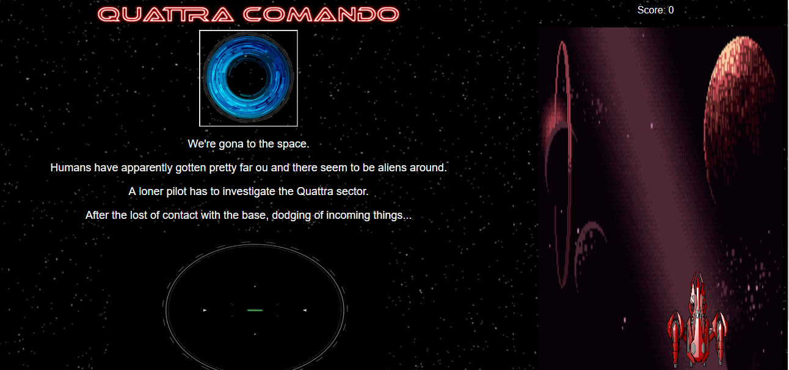

# Quattra-Comando
(MODULE 1, PROJECT)
Final project from first module from Web Developer from Ironhack, my first project, was a RPG but, due the time, I would need make some changes, and in this, this project was born.

<h2> Play here https://p4tt1xd.github.io/Quattra-Comando </h2>

<H1>INTRODUCTION</H1>
The name is a single tribute to a game from DOE Entertainment that I played when a child, and just loved it.
Besides RPG theme, I just love a scifi too.
I just hope that you all like this, good play, cadets!

<H1> CONTROLS </H1>
It's very simple fly with your ship, you just need:
<li>A to left</li>
<li>D to right</li>

<H1> CONTRIBUITIONS</H1>
This is a free software, feel free to colaborate...
And have fun!!!!

<li> Fork it </li>
<li> Create your feature branch (git checkout -b feature/fooBar) </li>
<li> Commit your changes (git commit -am 'Add some fooBar') </li>
<li> Push to the branch (git push origin feature/fooBar) </li>
<li> Create a new Pull Request </li>

